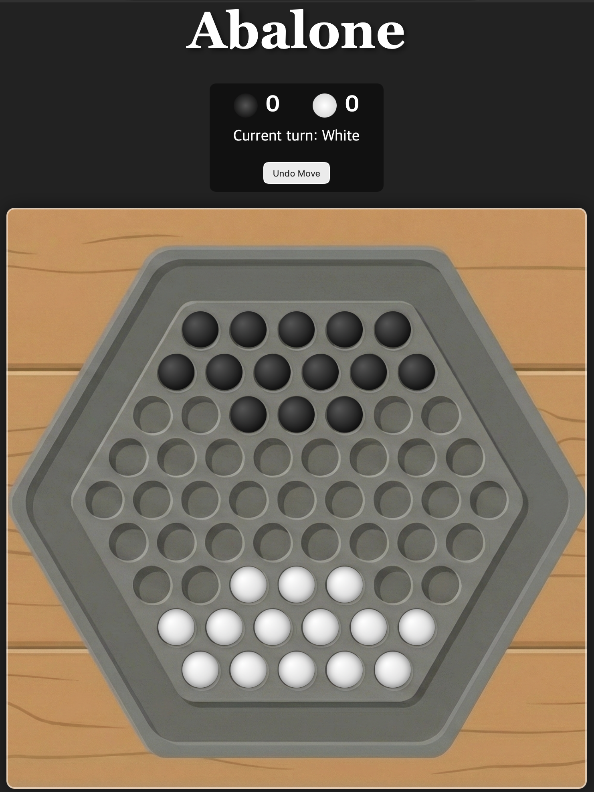

# Abalone Game / 아발론 게임

This project is a web-based implementation of the classic board game, Abalone. It was inspired by a request from client(which is my girlfriend) to have a version of the game that could be easily played on an iPad or any modern web browser.

이 프로젝트는 아발론(Abalone)이라는 클래식 보드게임을 웹으로 구현한 것입니다. 제 소중한 클라이언트인 여자 친구가 아발론을 아이패드로 하고 싶다고 해서 만들게 되었습니다.

## Features / 주요 기능

*   **Physics Gutter**: Pushed marbles out to board goes to a hexagonal gutter where they can be spun and played with using a custom physics engine.
    *   (밀려나간 구슬은 사라지지 않고, 육각형 트랙의 거터로 날아갑니다. 이곳에서 구슬을 던지거나 돌리며 가지고 놀 수 있습니다.)
*   **Undo Button**: Made a mistake? Rewind your move with a sleek popup notification.
    *   (실수를 하셨나요? 실행 취소 버튼을 눌러 수를 되돌릴 수 있습니다.)
*   **Sound Effects**: Audio for moving, colliding marbles.
    *   (구슬 이동, 충돌 시 효과음이 있습니다.)

## How to Play / 하는 방법

1.  Open the `index.html` file in a web browser to start game.
2.  The game will start with the standard Abalone setup.
3.  Click on your marbles to select them. You can select up to three in straight line.
4.  Click on the highlighted arrow to move your selected marbles one space.
5.  You can push your opponent's marbles if your line of selected marbles is longer than their line of marbles.
6.  The first player to have six of their marbles pushed off the board loses.

1.  웹브라우저에서 `index.html` 파일을 열어 게임을 시작합니다.
2.  게임은 기본 아발론 설정으로 시작됩니다.
3.  자신의 구슬을 클릭하여 선택합니다. 직선으로 자신의 구슬을 최대 3개까지 선택할 수 있습니다.
4.  선택된 구슬을 한 칸 이동하려면 원하는 방향으로 화살표를 클릭합니다.
5.  자신이 선택한 구슬이 상대방 구슬 보다 많다면, 상대방의 구슬을 밀 수 있습니다.
6.  먼저 6개의 구슬이 보드 밖으로 밀려난 플레이어가 패배합니다.

## Technologies Used

- HTML5
- CSS3
- JavaScript (ES6)
